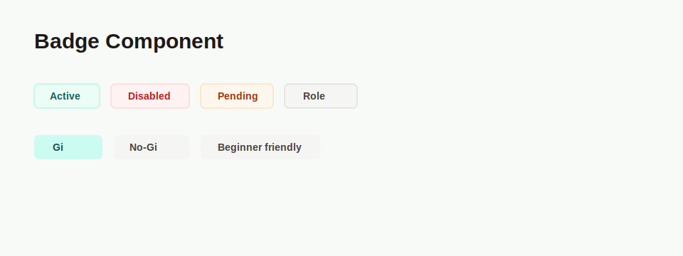

# PRD: Badge Component

## Implementation Metadata

- Suggested component name: `Badge`
- Suggested branch name: `feature/ui-badge-component`
- Status: Ready for development

## Objective

Create a reusable badge/tag component for statuses, roles, feature markers, categories, and capability labels.

The component should provide one shared primitive for compact labels across admin tables, detail pages, public cards, and form previews.

## Problem

The app currently has multiple local badge/status/tag implementations with similar intent but inconsistent styling, naming, tone mapping, radius, capitalization, border usage, and dot/ring treatment.

`TableStatusBadge` exists in the table package, but the wider app also has local badge patterns in admin users, academies, open mats, academy detail, academy form preview, public academy cards, and public academy detail pages.

## How This Fixes The Existing App

- Replaces local `Badge`, `StatusBadge`, `StatusPill`, and `RoleBadge` patterns with one shared component.
- Keeps status colors consistent for active, inactive, pending, disabled, verified, rejected, valid, and invalid states.
- Keeps admin role badges consistent without requiring every page to repeat role tone logic.
- Gives academy listing cards and detail pages the same treatment for affiliation, Gi, No-Gi, beginner friendly, competition, drop-in price, and event chips.
- Preserves `TableStatusBadge` as a compatibility wrapper so existing table exports and tests can migrate without unnecessary churn.

## Current Repeated Examples

- `TableStatusBadge` in `src/components/Table/TableStatusBadge.tsx`.
- Local admin user status and role badges in `src/app/admin/users/page.tsx`.
- Local admin dashboard user status badges in `src/app/admin/page.tsx`.
- Local admin academy and open mat list badges in `src/app/admin/academies/page.tsx` and `src/app/admin/open-mats/page.tsx`.
- Inline `StatusBadge` in `src/app/admin/academies/[id]/page.tsx`.
- Academy form preview status badge in `src/app/admin/academies/AcademyForm.tsx`.
- Public academy card tags in `src/components/AcademyCard.tsx`.
- Public academy detail capability tags in `src/app/academies/[slug]/page.tsx`.

## Requirements

### Props

- `children: React.ReactNode` SHALL be supported for explicit display text.
- `value?: string` SHALL be supported for enum-like values that should be normalized before display.
- `tone?: "neutral" | "success" | "warning" | "danger" | "info" | "accent" | "muted"` SHALL control visual meaning.
- `size?: "sm" | "md"` SHALL support compact table/card badges and larger detail-page badges.
- `variant?: "soft" | "outline"` SHALL support filled soft labels and bordered detail/table labels.
- `dot?: boolean` SHALL render an optional leading status dot.
- `className?: string` SHALL allow narrow layout adjustments without bypassing shared tone and size styles.

### Tone Mapping

- `success` SHALL be used for active, verified, valid, and featured states.
- `warning` SHALL be used for pending, pending verification, awaiting action, and inactive states.
- `danger` SHALL be used for disabled, rejected, invalid, archived, and destructive/error states.
- `info` SHALL be used for standard informational labels and non-critical highlighted states.
- `accent` SHALL be used for admin roles, protected markers, affiliation labels, and product-highlight labels when stronger emphasis is needed.
- `muted` SHALL be used for low-emphasis category labels and unavailable states.
- `neutral` SHALL be the default for unknown values, general category tags, and caller-provided children without a tone.

### Label Normalization

- The component SHALL display `children` exactly when `children` is supplied.
- The component SHALL normalize `value` when no `children` are supplied.
- Enum-like strings SHALL be converted into readable labels.
- `PENDING_VERIFICATION` SHALL render as `Pending Verification`.
- `NO_GI` SHALL render as `No-Gi`.
- `STANDARD_USER` SHALL render as `Standard User`.
- `ACADEMY_ADMIN` SHALL render as `Academy Admin`.
- `PLATFORM_ADMIN` SHALL render as `Platform Admin`.
- Unknown values SHALL still render as readable title-cased labels.

### Behavior

- The component SHALL render as a `span` by default.
- The component SHALL support table cells, detail pages, card tag groups, form previews, and filter/status summaries.
- The component SHALL not be coupled to `Table`.
- The component SHALL not contain domain-specific routing or actions.
- The component SHALL not infer sensitive authorization visibility rules; callers remain responsible for deciding which labels can be shown.
- New app/page usage SHOULD import `Badge` directly instead of using `TableStatusBadge`.

### Compatibility

- `TableStatusBadge` SHALL remain exported from `src/components/Table`.
- `TableStatusBadge` SHALL be implemented as a thin wrapper around `Badge`.
- `TableStatusBadge` SHALL be documented as a legacy/table convenience wrapper.
- Existing table tests importing `TableStatusBadge` SHALL continue to pass.

## Accessibility Requirements

- Badge text must communicate meaning without relying only on color.
- Status dots SHALL be decorative and use `aria-hidden="true"`.
- Badges SHALL remain readable at compact table sizes.
- Abbreviated visible text SHALL provide an accessible label when the abbreviation would be unclear.
- Color contrast SHALL remain suitable for the supported tones in both soft and outline variants.

## Technical Requirements

- Location: `src/components/ui/Badge.tsx`.
- Use TypeScript props.
- Use `clsx` for tone, size, variant, dot, and caller class composition.
- Keep the component server-compatible.
- Preserve `TableStatusBadge` as a wrapper until all callers are migrated and table package compatibility is intentionally revisited.

## Migration Targets

1. `src/components/Table/TableStatusBadge.tsx`
2. `src/app/admin/users/page.tsx`
3. `src/app/admin/page.tsx`
4. `src/app/admin/academies/page.tsx`
5. `src/app/admin/open-mats/page.tsx`
6. `src/app/admin/academies/[id]/page.tsx`
7. `src/app/admin/academies/AcademyForm.tsx`
8. `src/components/AcademyCard.tsx`
9. `src/app/academies/[slug]/page.tsx`

## Acceptance Criteria

- `Badge` can replace existing local admin status badges without visual or meaning regression.
- `Badge` can replace existing local admin role badges while preserving distinct role emphasis.
- `Badge` can replace `TableStatusBadge` usage through the compatibility wrapper.
- `Badge` can replace inline admin academy detail status badges.
- `Badge` can replace academy capability, affiliation, price, and event tags.
- `children` display text is preserved exactly.
- `value` normalization covers known enum-like values and unknown fallback values.
- `tone`, `size`, `variant`, `dot`, and `className` work together without breaking layout.
- Status dots are hidden from assistive technology.
- Unknown values use neutral styling instead of failing or rendering empty content.

## Test Requirements

- Tests cover enum normalization for `PENDING_VERIFICATION`, `NO_GI`, `STANDARD_USER`, `ACADEMY_ADMIN`, and `PLATFORM_ADMIN`.
- Tests cover fallback normalization for unknown enum-like values.
- Tests cover tone class selection for success, warning, danger, info, accent, muted, and neutral.
- Tests cover `size`, `variant`, `dot`, `children`, and `className`.
- Tests cover `TableStatusBadge` wrapper compatibility.
