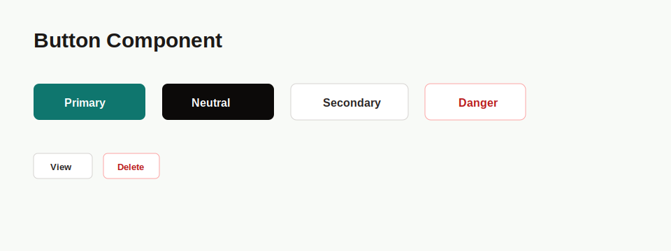

# PRD: Button Component

## Implementation Metadata

- Suggested component name: `Button`
- Suggested branch name: `feature/ui-button-component`

## Objective

Create a reusable button/link primitive for repeated RollFinders action styling across public cards, dashboard pages, admin pages, filter forms, CRUD forms, and table row actions.

## Problem

Button and link actions are currently styled inline in many pages. This creates repeated Tailwind class strings and makes visual drift likely across primary, secondary, neutral, destructive, and compact row actions.

## Current Repeated Examples

- Page actions: `Dashboard`, `New Academy`, `New Open Mat`.
- Form actions: `Apply Filters`, `Reset`, `Save Academy`, `Save Open Mat`.
- Row actions: `View`, `Edit`, `Delete`, `Disable`, `Send Password Email`.
- Public card actions: `Details`, `View Details`, `Directions`.

## Requirements

### Variants

- `primary`: teal background, white text.
- `neutral`: stone/near-black background, white text.
- `secondary`: white or transparent background, stone border, stone text.
- `danger`: white or transparent background, red border, red text.
- `subtle`: low-emphasis action for compact utility controls.

### Sizes

- `md`: minimum height `44px`, used for page-level and form actions.
- `sm`: compact table row and panel actions.
- `icon`: fixed square control for icon-only actions.

### Behavior

- The component SHALL render as a `button`, Next `Link`, or external `a` based on props.
- The component SHALL support `type`, `href`, `target`, `rel`, `disabled`, `aria-disabled`, and `className`.
- Disabled buttons SHALL use the native `disabled` attribute.
- Disabled links SHALL use `aria-disabled` and avoid navigation behavior.
- Icon-only buttons SHALL require an accessible label.
- Focus-visible state SHALL use the existing teal focus color.

## Accessibility Requirements

- Text labels must remain readable at mobile widths.
- Icon-only controls must include `aria-label`.
- Disabled states must not rely on color alone.
- Keyboard focus must be visible for buttons and links.

## Technical Requirements

- Location: `src/components/ui/Button.tsx`.
- Use TypeScript props.
- Use `clsx` for variant class composition.
- Remain server-compatible.
- Avoid introducing a new dependency.

## Acceptance Criteria

- `Button` can replace page action links without visual regression.
- `Button` can replace submit buttons in server forms.
- `Button` can replace compact table row actions.
- `Button` supports destructive row actions using the `danger` variant.
- Automated tests cover variants, sizes, `button` rendering, `Link` rendering, external anchor rendering, disabled states, and icon label requirements.

## Migration Targets

1. Admin page header actions.
2. Admin filter form actions.
3. Table row actions.
4. Public card actions.
5. CRUD form submit buttons.
