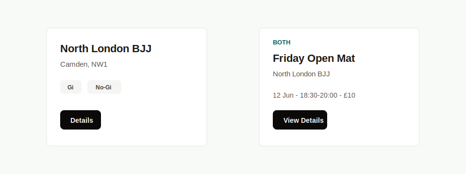

# PRD: Domain Cards

## Implementation Metadata

- Suggested component names: `AcademyCard`, `EventCard`, `ModuleCard`
- Suggested branch name: `feature/ui-domain-card-standardization`

## Objective

Standardize shared pieces used by domain-specific cards while keeping domain card content specialized.

## Problem

`AcademyCard`, `EventCard`, dashboard module cards, contact cards, and simple public cards share surface, tag, and action styles. They should reuse low-level UI primitives without becoming one overly generic card component.

## Current Targets

- `src/components/AcademyCard.tsx`
- `src/components/EventCard.tsx`
- Dashboard module cards in `src/app/admin/page.tsx`
- Contact/public cards in static pages

## Requirements

### Behavior

- Domain cards SHALL keep domain-specific layout and content.
- Domain cards SHALL use shared `Button` for actions.
- Domain cards SHALL use shared `Badge` for tags and statuses.
- Domain cards SHALL use shared `PanelSurface` for the outer white bordered surface where practical.
- Academy and event cards SHALL remain separate components.

## Non-Goals

- Do not merge `AcademyCard` and `EventCard` into a single generic card.
- Do not redesign public search/listing pages.
- Do not remove domain-specific icons or data formatting.

## Accessibility Requirements

- Card action links must remain keyboard accessible.
- Card headings must preserve logical hierarchy.
- Tags must communicate meaning in text.
- External links such as directions must preserve `target` and `rel` behavior.

## Technical Requirements

- Keep domain cards in their current component locations unless a larger folder reorganization is approved.
- Use shared UI primitives from `src/components/ui/`.
- Keep formatting helpers in `src/lib/utils.ts`.

## Acceptance Criteria

- `AcademyCard` uses shared action, badge, and surface primitives without changing displayed content.
- `EventCard` uses shared action and surface primitives without changing displayed content.
- Dashboard module cards use shared surface and action styling.
- Tests or visual checks confirm no major layout regressions in academy and open mat listings.
