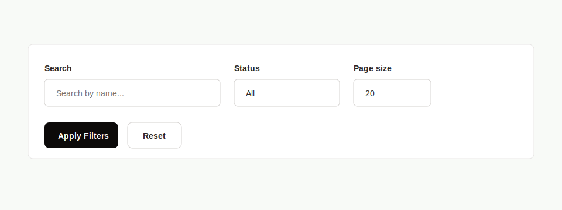

# PRD: Filter Form Component

## Implementation Metadata

- Suggested component name: `FilterForm`
- Suggested branch name: `feature/ui-filter-form-component`

## Objective

Create reusable server-compatible filter form components for search and filter controls across admin list pages and dashboard member search.

## Problem

Filter forms repeat the same layout and control styling across users, academies, open mats, and members. The behavior is simple and server-driven, but the markup is duplicated.

## Current Repeated Examples

- `src/app/admin/users/page.tsx`
- `src/app/admin/academies/page.tsx`
- `src/app/admin/open-mats/page.tsx`
- `src/app/dashboard/members/page.tsx`

## Components

- `FilterForm`
- `FilterField`
- `FilterInput`
- `FilterSelect`
- `FilterActions`

## Requirements

### Behavior

- Filter forms SHALL use normal GET submission by default.
- The component system SHALL preserve existing query-driven filtering.
- Fields SHALL support responsive grid column spans.
- Fields SHALL support input, select, date, hidden, and future field types.
- Reset actions SHALL use the shared `Button` component or compatible link styling.
- Submit actions SHALL remain compatible with server-rendered pages.

### Props

- `action`
- `method`
- `children`
- `columns`
- `className`
- Field-level `label`, `name`, `defaultValue`, `placeholder`, `type`, `options`, and `colSpan`.

## Accessibility Requirements

- Every visible input/select must have an associated label.
- Form controls must retain visible focus styles.
- Submit and reset actions must be keyboard accessible.
- Controls must not overflow in narrow mobile layouts.

## Technical Requirements

- Location: `src/components/ui/FilterForm.tsx`.
- Remain server-compatible.
- Use TypeScript props.
- Use Tailwind and `clsx`.
- Avoid client-side state unless a future field requires it.

## Acceptance Criteria

- `FilterForm` can render user filters without changing query behavior.
- `FilterForm` can render academy filters without changing query behavior.
- `FilterForm` can render open mat filters without changing query behavior.
- `FilterForm` supports date fields for open mat filters.
- Tests cover form action/method, label association, select options, default values, and responsive class hooks.

## Open Question

Should filter forms be fully declarative from a configuration array, or should they remain compositional with explicit JSX fields?
