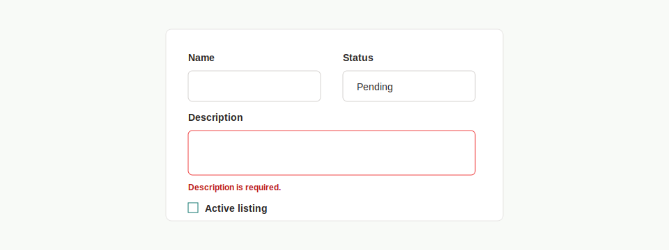

# PRD: Form Field System

## Implementation Metadata

- Suggested component names: `FormCard`, `FormMessage`, `Field`, `TextareaField`, `SelectField`, `CheckboxField`, `FieldError`
- Suggested branch name: `feature/ui-form-field-system`

## Objective

Create reusable form field components for CRUD forms, authentication forms, password forms, and action-state validation feedback.

## Problem

CRUD forms repeat local `Field`, `FieldError`, select, textarea, checkbox, and form message patterns. These forms have similar validation and accessibility needs but are implemented separately.

## Current Repeated Examples

- `src/app/admin/academies/form.tsx`
- `src/app/admin/open-mats/form.tsx`
- `src/app/dashboard/password/ChangePasswordForm.tsx`
- `src/app/reset-password/[token]/ResetPasswordForm.tsx`
- `src/app/login/LoginForm.tsx`

## Components

- `FormCard`
- `FormMessage`
- `Field`
- `TextareaField`
- `SelectField`
- `CheckboxField`
- `FieldError`

## Requirements

### Behavior

- Components SHALL work in client components that use `useActionState`.
- Fields SHALL accept `name`, `label`, `defaultValue`, `required`, `type`, `errors`, and `children`.
- Select fields SHALL accept either children options or an options array.
- Textarea fields SHALL support minimum height configuration.
- Checkbox fields SHALL support a hidden fallback value for server actions that expect `off`.
- Form messages SHALL support success and error tones.
- Field errors SHALL render consistently below controls.

## Accessibility Requirements

- Fields with errors SHALL set `aria-invalid`.
- Field errors SHALL be connected through `aria-describedby`.
- Labels SHALL be programmatically associated with controls.
- Form-level messages SHOULD use an appropriate status or alert role based on severity.
- Disabled and pending states must be communicated visually and semantically.

## Technical Requirements

- Location: `src/components/ui/Field.tsx` and `src/components/ui/FormCard.tsx`.
- Use TypeScript props.
- Use Tailwind and `clsx`.
- Client-only behavior should be limited to consuming components; field primitives should remain server-compatible where possible.

## Acceptance Criteria

- Shared fields can replace local `Field` and `FieldError` in academy forms.
- Shared fields can replace local `Field` and `FieldError` in open mat forms.
- Shared messages can replace login, password, and reset password message blocks.
- Tests cover input, textarea, select, checkbox fallback, error rendering, and `aria-describedby`.

## Migration Targets

1. `src/app/admin/academies/form.tsx`
2. `src/app/admin/open-mats/form.tsx`
3. `src/app/dashboard/password/ChangePasswordForm.tsx`
4. `src/app/reset-password/[token]/ResetPasswordForm.tsx`
5. `src/app/login/LoginForm.tsx`
