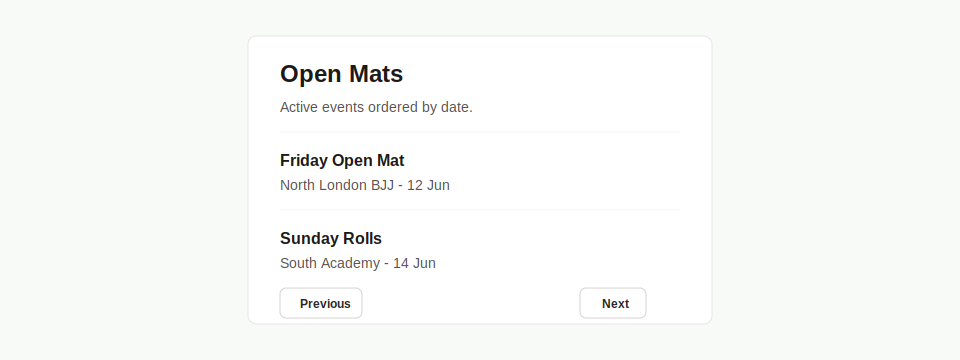

# PRD: List Panel Component

## Implementation Metadata

- Suggested component name: `ListPanel`
- Suggested branch name: `feature/ui-list-panel-component`

## Objective

Create a compact reusable list panel for admin dashboard summary lists.

## Problem

The admin dashboard has small paginated panels for academies and open mats. They are not full tables, but they repeat a panel header, linked rows, empty/list states, and pagination controls.

## Current Repeated Examples

- Admin dashboard `Academies` panel.
- Admin dashboard `Open Mats` panel.

## Requirements

### Props

- `title`
- `description`
- `items`
- `pagination`
- `emptyMessage`
- `id`
- `className`

### Item Shape

- `id`
- `primary`
- `secondary`
- `href`

### Behavior

- The component SHALL render a panel header with title and description.
- The component SHALL render linked rows with primary and secondary text.
- The component SHALL support an empty state.
- The component SHALL support pagination.
- Pagination SHOULD reuse existing table pagination primitives where practical.
- The component SHALL preserve current admin dashboard density.

## Accessibility Requirements

- Linked rows must have readable names.
- Pagination controls must expose disabled/current states.
- Panel title should be rendered as a heading.

## Technical Requirements

- Location: `src/components/ui/ListPanel.tsx`.
- Remain server-compatible.
- Use TypeScript props.
- Prefer existing pagination helpers where possible.

## Acceptance Criteria

- `ListPanel` replaces `AdminPanel`, `Row`, `Pagination`, and `PaginationLink` local helpers where appropriate.
- It supports independent pagination keys for multiple panels on one page.
- Tests cover item rendering, empty state, previous/next states, and href generation hooks.

## Open Question

Should pagination href construction live inside `ListPanel`, or should pages pass already-built `previousHref` and `nextHref` values like the existing `TablePagination` component?
