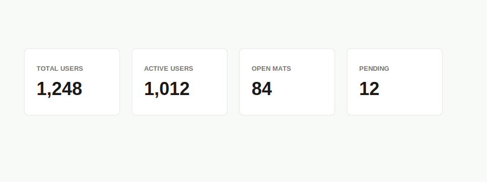

# PRD: Metric Card Component

## Implementation Metadata

- Suggested component name: `MetricCard`
- Suggested branch name: `feature/ui-metric-card-component`

## Objective

Create a reusable metric card for dashboard and admin summary counts.

## Problem

Several pages define local `Metric` functions with the same white card layout, uppercase label, and large numeric value. This repeats code and makes future metric changes harder to apply consistently.

## Current Repeated Examples

- Total Users, Active Users, Disabled Users.
- Total Academies, Verified Academies, Pending Verification.
- Active Open Mats, Upcoming Active.
- Admin dashboard summary metrics.

## Requirements

### Props

- `label`
- `value`
- `description`
- `tone`
- `href`
- `className`

### Behavior

- The component SHALL render a compact white bordered card.
- Numeric values SHALL be formatted with locale separators by default.
- String values SHALL be supported for non-numeric metrics.
- When `href` is supplied, the card SHALL render as a link.
- The component SHALL support optional description text below the value.

## Accessibility Requirements

- Linked cards must have a clear accessible name from label and value.
- Metrics must preserve readable contrast.
- The component must not use color as the only indicator of meaning.

## Technical Requirements

- Location: `src/components/ui/MetricCard.tsx`.
- Remain server-compatible.
- Use TypeScript props.
- Use shared `Panel` or `Surface` styles if implemented first.

## Acceptance Criteria

- `MetricCard` removes local `Metric` functions from admin pages.
- Numeric values display with `toLocaleString()`.
- Optional link behavior works without changing the visual layout.
- Tests cover numeric value, string value, optional description, and link rendering.

## Migration Targets

1. `src/app/admin/page.tsx`
2. `src/app/admin/users/page.tsx`
3. `src/app/admin/academies/page.tsx`
4. `src/app/admin/open-mats/page.tsx`
