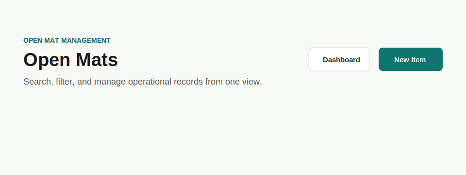

# PRD: Page Header Component

## Implementation Metadata

- Suggested component name: `PageHeader`
- Suggested branch name: `feature/ui-page-header-component`

## Objective

Create a reusable page header for admin and content pages with title, optional eyebrow, description, and action controls.

## Problem

Admin pages repeat the same header structure: a left content block and right-aligned actions on wider screens. Repeating this markup makes spacing, typography, and action alignment drift over time.

## Current Repeated Examples

- Admin dashboard.
- User Management.
- Academy Management.
- Open Mat Management.
- Settings pages.

## Requirements

### Props

- `eyebrow`
- `title`
- `description`
- `actions`
- `variant`
- `className`

### Behavior

- The component SHALL render stacked content on mobile.
- The component SHALL align actions to the right on larger viewports.
- The component SHALL support pages without an eyebrow.
- The component SHALL accept one or many actions, preferably rendered with the shared `Button` component.
- The component SHALL preserve current admin heading typography.

## Accessibility Requirements

- The page title SHALL render as an `h1` by default.
- Action order SHALL match the visual and keyboard tab order.
- Header copy SHALL not be hidden from assistive technology.

## Technical Requirements

- Location: `src/components/ui/PageHeader.tsx`.
- Remain server-compatible.
- Use TypeScript props.
- Accept `ReactNode` actions for flexibility.

## Acceptance Criteria

- `PageHeader` replaces duplicated header markup in admin list pages.
- The component supports a no-eyebrow dashboard header.
- Actions remain responsive and do not overlap page titles or descriptions.
- Tests cover rendering with and without eyebrow, with single action, and with multiple actions.

## Migration Targets

1. `src/app/admin/users/page.tsx`
2. `src/app/admin/academies/page.tsx`
3. `src/app/admin/open-mats/page.tsx`
4. `src/app/admin/page.tsx`
5. `src/app/admin/settings/page.tsx`
