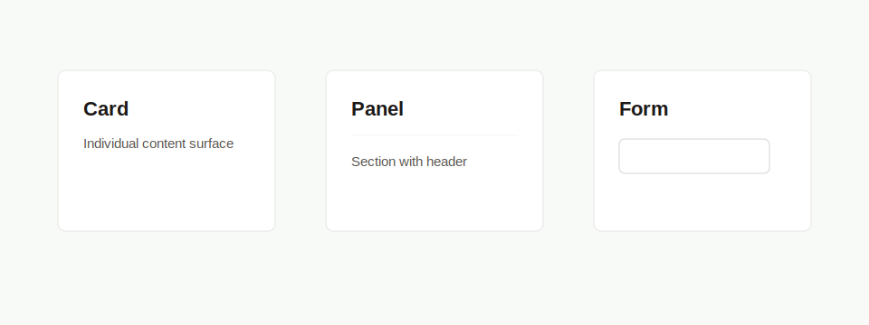

# PRD: Panel Surface Component

## Implementation Metadata

- Suggested component name: `Panel`
- Suggested branch name: `feature/ui-panel-surface-component`

## Objective

Create a reusable white bordered surface component for cards, panels, and form containers.

## Problem

Many pages repeat `rounded-lg border border-stone-200 bg-white p-4 shadow-sm`. A shared surface component would keep layout styling consistent while allowing domain content to stay specialized.

## Current Repeated Examples

- Admin dashboard panels.
- Settings panels.
- Dashboard profile and roll cards.
- Login and password form cards.
- Public map, contact, academy, and event cards.

## Variants

- `card`: individual item or metric.
- `panel`: section with optional header and body.
- `form`: form surface.

## Requirements

### Behavior

- The component SHALL preserve 8px border radius.
- The component SHALL support optional padding variants.
- The component SHALL support optional title and description when used as a panel.
- The component SHALL render as `div`, `section`, `article`, or `Link` based on props.
- The component SHALL allow `className` overrides for layout only.

## Design Requirements

- Do not create cards inside cards.
- Keep admin surfaces compact and scannable.
- Preserve current white background, stone border, and subtle shadow.

## Accessibility Requirements

- Section panels with titles should expose semantic headings.
- Linked surfaces should have a clear accessible name.
- Decorative shadow/border styling must not carry semantic meaning.

## Technical Requirements

- Location: `src/components/ui/Panel.tsx` or `src/components/ui/Surface.tsx`.
- Remain server-compatible.
- Use TypeScript props.
- Use `clsx` for variants.

## Acceptance Criteria

- `PanelSurface` can replace repeated white bordered surfaces without changing layout.
- `PanelSurface` supports section, article, div, and linked card use cases.
- Tests cover variants, rendered element type, optional header, and linked rendering.
