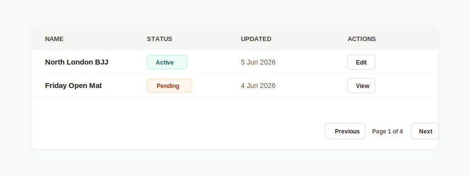

# PRD: Reusable Responsive Table Component



## Component Name

`Table`

## Feature Branch

`feature/reusable-table-component`

---

# Objective

Create a reusable, configurable, responsive table component that can be used throughout the application for displaying Open Mats, Users, Academies, Reports, and future datasets.

The component MUST follow existing dashboard UI patterns and styling.

The component MUST NOT be coupled to any specific business entity.

The component MUST be fully driven by props and configuration.

---

# Component Location

## Scenario: Create Table Component Structure

IF the reusable table component is implemented

WHEN the component is created

THEN the system SHALL create the component structure below:

```txt
components/
└── Table/
    ├── index.tsx
    ├── TableHeader.tsx
    ├── TableBody.tsx
    ├── TableRow.tsx
    ├── TableCell.tsx
    ├── TableActions.tsx
    ├── TablePagination.tsx
    ├── TableStatusBadge.tsx
    ├── TableEmptyState.tsx
    ├── TableLoadingState.tsx
    ├── types.ts
    └── __tests__/
        ├── Table.test.tsx
        ├── TablePagination.test.tsx
        └── TableEmptyState.test.tsx
```

AND each component SHALL be contained within its own file.

AND the main entry point SHALL be:

```txt
components/Table/index.tsx
```

---

# Dynamic Table Title

## Scenario: Render Dynamic Title

IF a title prop is supplied

WHEN the component renders

THEN the component SHALL display the supplied title.

AND the component SHALL NOT hardcode any title.

Examples:

```tsx
<Table title="Open Mats" />
```

```tsx
<Table title="Users" />
```

```tsx
<Table title="Academies" />
```

AND the title SHALL use existing dashboard heading styles.

---

# Dynamic Columns

## Scenario: Render Dynamic Column Definitions

IF column definitions are provided

WHEN the table renders

THEN the component SHALL generate column headers dynamically.

AND the component SHALL NOT hardcode any column names.

AND the order of rendered columns SHALL match the order supplied.

Example:

```tsx
const columns = [
  {
    key: "title",
    title: "Title"
  },
  {
    key: "academy",
    title: "Academy"
  },
  {
    key: "date",
    title: "Date"
  },
  {
    key: "time",
    title: "Time"
  },
  {
    key: "giType",
    title: "Gi Type"
  },
  {
    key: "price",
    title: "Price"
  },
  {
    key: "capacity",
    title: "Capacity"
  },
  {
    key: "status",
    title: "Status"
  },
  {
    key: "actions",
    title: "Actions"
  }
];
```

---

# Dynamic Data Rendering

## Scenario: Render Table Data

IF data rows are provided

WHEN the component renders

THEN the component SHALL render rows dynamically.

AND each column SHALL display the matching property using the column key.

AND the component SHALL support any data structure.

---

# Custom Cell Rendering

## Scenario: Render Custom Components

IF a column definition contains a custom render function

WHEN the table renders

THEN the render function SHALL be used.

Example:

```tsx
{
  key: "status",
  title: "Status",
  render: (value, row) => (
    <TableStatusBadge status={value} />
  )
}
```

AND custom renderers SHALL support:

* Badges
* Buttons
* Links
* Icons
* React Components
* Action Menus

---

# Action Column

## Scenario: Render Row Actions

IF action definitions are supplied

WHEN the table renders

THEN the Actions column SHALL render supplied actions.

Example:

```tsx
actions={[
  {
    label: "View",
    onClick: handleView
  },
  {
    label: "Edit",
    onClick: handleEdit
  }
]}
```

AND actions SHALL remain configurable.

AND the component SHALL NOT hardcode View or Edit actions.

---

# Status Badges

## Scenario: Render Status Values

IF a status field is supplied

WHEN the table renders

THEN status values SHALL support badge rendering.

Examples:

* Active
* Pending
* Disabled
* Archived

AND styling SHALL follow existing dashboard badge styles.

---

# Pagination

## Scenario: Render Pagination

IF pagination information is supplied

WHEN the table renders

THEN the component SHALL display:

* Previous button
* Next button
* Current page
* Total pages

AND disabled controls SHALL be visually disabled.

AND disabled controls SHALL NOT be clickable.

---

## Scenario: Require Pagination For Dynamic Tables

IF a table renders dynamic or operational data

AND the dataset can exceed the configured page size

WHEN the table is implemented by a page, panel, or drilldown view

THEN the consumer SHALL pass pagination information to the reusable `Table`.

AND the consumer SHALL preserve the current filter, search, tab, metric, or drilldown view while changing pages.

AND the table SHALL handle empty, single-page, first-page, middle-page, and last-page states without broken controls.

AND the component SHALL remain data-source agnostic.

AND the component SHALL render pagination controls from props.

AND the component SHALL allow each consuming page or panel to define its own page size.

AND the component SHALL NOT own business-specific fetching, filtering, routing, or URL state.

---

# Loading State

## Scenario: Render Loading State

IF loading is true

WHEN the table renders

THEN the component SHALL display a loading state.

AND table content SHALL NOT be rendered until loading completes.

---

# Empty State

## Scenario: Render Empty State

IF no records exist

WHEN the table renders

THEN the component SHALL display an empty state message.

Example:

```txt
No records found.
```

AND the component SHALL NOT display an empty table structure.

---

# Responsive Behaviour

## Scenario: Mobile Responsiveness

IF the viewport width is reduced

WHEN the table renders

THEN the component SHALL remain usable.

AND the component SHALL render a mobile-first card list on small viewports.

AND each mobile card SHALL show the first configured column as the primary row value.

AND remaining configured columns SHALL render as labelled detail rows.

AND mobile cards SHALL use the same column order, custom render functions, links, badges, and row actions as the desktop table.

AND the semantic HTML table SHALL remain available for medium and larger viewports.

AND horizontal scrolling SHALL be supported for the desktop table layout when required.

AND columns SHALL remain readable.

AND actions SHALL remain accessible.

AND content SHALL NOT overflow its parent container.

---

# Accessibility

## Scenario: Accessible Table

IF users interact with the component

WHEN the table renders

THEN semantic HTML table markup SHALL be used.

AND all buttons SHALL have accessible labels.

AND keyboard navigation SHALL be supported.

AND focus states SHALL be visible.

---

# TypeScript Requirements

## Scenario: Strong Typing

IF the component is implemented

WHEN TypeScript interfaces are created

THEN all public props SHALL be strongly typed.

AND reusable interfaces SHALL be defined in:

```txt
components/Table/types.ts
```

---

# Unit Testing

## Scenario: Component Testing

IF automated tests run

WHEN the test suite executes

THEN tests SHALL verify:

* Table renders successfully
* Dynamic title renders
* Dynamic columns render
* Dynamic rows render
* Custom render functions execute
* Actions render correctly
* Pagination renders correctly
* Loading state renders
* Empty state renders

---

# Acceptance Criteria

* Create `components/Table/index.tsx`.
* Create one file per child component.
* Follow existing dashboard design patterns.
* Support dynamic titles.
* Support dynamic columns.
* Support dynamic row data.
* Support custom render functions.
* Support configurable actions.
* Support pagination.
* Support loading states.
* Support empty states.
* Support responsive layouts.
* Support accessibility requirements.
* Use TypeScript throughout.
* Add functional unit tests.
* Maintain backward compatibility with existing functionality.
* Only implement changes directly related to this component.

---

# Current Implementation Status

Reviewed against source code on 2026-06-05.

Status: Implemented.

Implemented:

* `src/components/Table/index.tsx` exists.
* Child components exist for actions, body, cell, empty state, header, loading state, pagination, row, status badge, and types.
* Dynamic title, columns, row data, custom render functions, configurable actions, pagination, loading state, empty state, responsive horizontal overflow, and semantic table markup are implemented.
* Mobile card rendering is implemented for small viewports while preserving the desktop semantic table from medium viewports upward.
* Unit tests exist for table rendering, mobile card rendering, custom render functions, row actions, empty/loading states, and pagination.

MVP gaps or notes:

* Keep future table enhancements additive so current admin pages continue to render correctly.

MVP decision:

* This component is complete for MVP.
