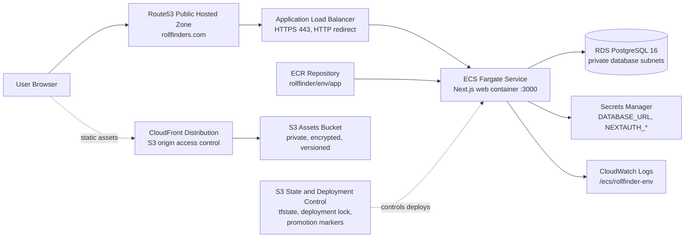
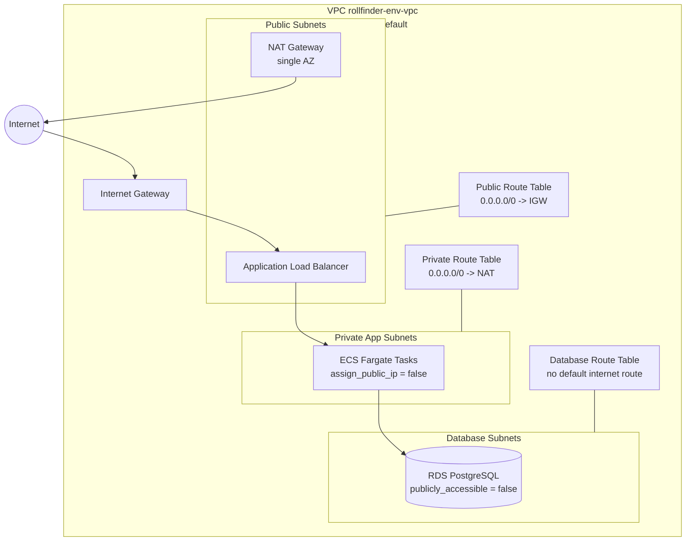
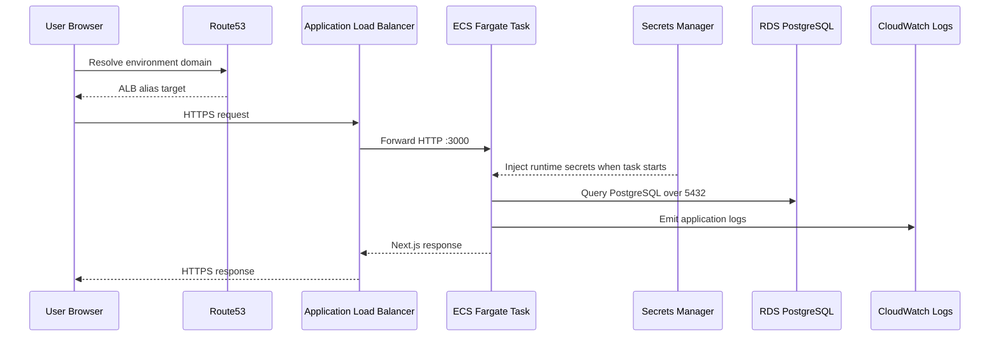
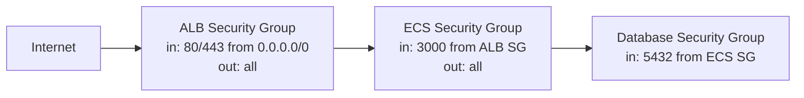

# RollFinder AWS Deployment Architecture

This artifact describes the AWS resources used to run RollFinder and how they relate to each other. It reflects the Terraform stack in `terraform/main.tf` and the environment values under `terraform/environments`.

## System Context

RollFinder is a Next.js application packaged as a Docker image, pushed to Amazon ECR, and deployed on ECS Fargate. Public traffic enters through Route53 and an internet-facing Application Load Balancer. ECS tasks run in private subnets and connect to a private RDS PostgreSQL database. Static asset infrastructure is prepared through S3 and CloudFront.

## Network Topology

Each environment creates its own VPC in `eu-west-2` across two availability zones by default.

## Request Flow

## Security Boundaries

Key controls:

- Public ingress is limited to the ALB on ports `80` and `443`.
- HTTP is redirected to HTTPS.
- ECS tasks are not assigned public IPs.
- RDS is private, encrypted, and only accepts PostgreSQL traffic from the ECS security group.
- ECS receives `DATABASE_URL`, `NEXTAUTH_SECRET`, and `NEXTAUTH_URL` from Secrets Manager at task startup through the execution role.
- ECR scans images on push and uses AES-256 encryption.
- S3 assets bucket is private, encrypted, and versioned.
- Deployment locks and promotion markers are S3-backed, defaulting to the dev Terraform state bucket unless overridden.

## Environment Matrix

| Environment | Domain | Desired ECS Tasks | RDS Class | Production Controls |
| --- | --- | ---: | --- | --- |
| dev | `dev.rollfinders.com` | 1 | `db.t4g.micro` | 7-day backups, no deletion protection |
| production | `rollfinders.com` | 2 | `db.t4g.small` | Multi-AZ, 14-day backups, deletion protection, final snapshot |

## DNS Names

| Name | Target |
| --- | --- |
| Frontend domain | ALB alias record |
| API domain | ALB alias record, `api.rollfinders.com` in production and `api.<env-domain>` elsewhere |
| WWW domain | Production only, ALB alias record with HTTPS listener redirect to canonical domain |
| Static assets URL | CloudFront default distribution domain |

## Operational Notes

- Terraform remote state is bootstrapped per environment with encrypted, versioned S3 buckets.
- The deployment scripts also use S3 objects for the global deployment lock and promotion markers.
- ECS service has container insights enabled and logs to CloudWatch.
- ECS service auto scaling targets average CPU at 70 percent, with max capacity `2` outside production and `6` in production.
- The application health check endpoint is `/api/health` at both ALB target group and container levels.
