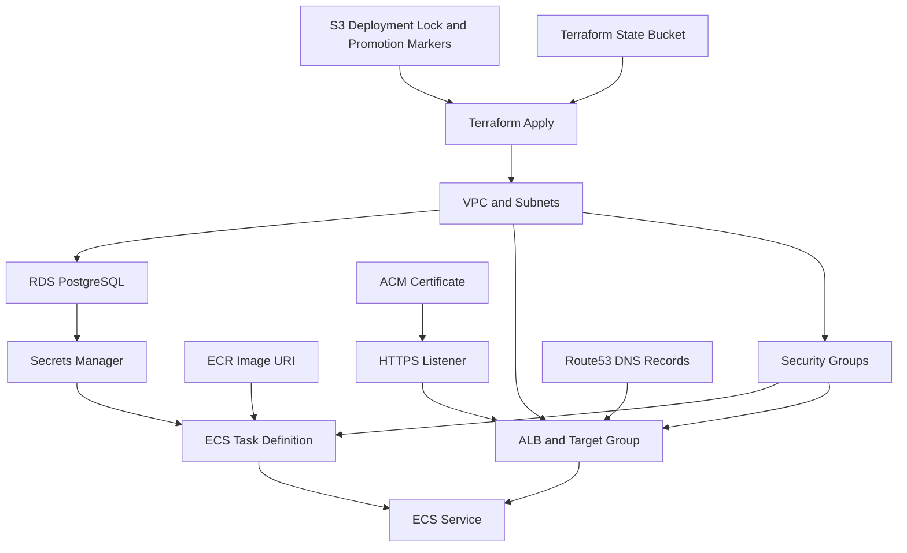

# AWS Resource Inventory and Relationships

This inventory summarizes the deployed AWS resources, their purpose, and their primary relationships.

| Layer | Resource | Terraform Address | Purpose | Relationships |
| --- | --- | --- | --- | --- |
| DNS | Route53 hosted zone lookup | `data.aws_route53_zone.public` | Uses existing public hosted zone | Feeds DNS records and ACM validation |
| DNS | Frontend A record | `module.app_dns_records.aws_route53_record.frontend` | Canonical application domain | Alias to ALB |
| DNS | API A record | `module.app_dns_records.aws_route53_record.api` | Prepared API hostname | Alias to ALB |
| DNS | WWW A record | `module.app_dns_records.aws_route53_record.www` | Production `www` hostname | Alias to ALB; redirected by listener rule |
| TLS | ACM certificate | `module.certificate` | TLS certificate for app domains | Validated by Route53 DNS records; attached to HTTPS listener |
| Network | VPC | `module.networking.module.vpc` | Environment network boundary | Contains public, private, and database subnets |
| Network | Internet Gateway | `module.networking.aws_internet_gateway.main` | Public internet ingress/egress | Attached to VPC; used by public route table |
| Network | Public subnets | `module.networking.aws_subnet.public` | ALB and NAT placement | Route to Internet Gateway |
| Network | Private subnets | `module.networking.aws_subnet.private` | ECS task placement | Route egress through NAT Gateway |
| Network | Database subnets | `module.networking.aws_subnet.database` | RDS placement | No default internet route |
| Network | NAT Gateway and EIP | `module.networking.aws_nat_gateway.main`, `module.networking.aws_eip.nat` | Private subnet outbound access | Placed in first public subnet |
| Security | ALB security group | `module.alb_security_group` | Public web ingress | Allows `80` and `443` from internet; source for ECS SG |
| Security | ECS security group | `module.ecs_security_group` | Application task ingress | Allows `3000` from ALB SG; source for database SG |
| Security | Database security group | `module.database_security_group` | PostgreSQL ingress | Allows `5432` from ECS SG |
| Compute | ECR repository | `module.ecr.aws_ecr_repository.app` | Stores application image | Pipeline pushes image; ECS task pulls deployment `image_uri` |
| Compute | ECR lifecycle policy | `module.ecr.aws_ecr_lifecycle_policy.app` | Expires older images | Keeps latest configured image count |
| Compute | ECS cluster | `module.app_service.aws_ecs_cluster.cluster` | Fargate cluster | Hosts the `web` service |
| Compute | ECS task definition | `module.app_service.aws_ecs_task_definition.task` | Web container runtime spec | Uses ECR image, Secrets Manager secrets, CloudWatch logs |
| Compute | ECS service | `module.app_service.aws_ecs_service.service` | Runs and replaces Fargate tasks | Attached to ALB target group in private subnets |
| Compute | App Auto Scaling target | `module.ecs_autoscaling.aws_appautoscaling_target.ecs` | ECS desired count scaling boundary | Scales ECS service |
| Compute | CPU scaling policy | `module.ecs_autoscaling.aws_appautoscaling_policy.cpu` | Target tracking at 70 percent CPU | Applies to ECS service scalable target |
| Traffic | Application Load Balancer | `module.alb.aws_lb.app` | Public application entrypoint | Public subnets, ALB SG, Route53 alias records |
| Traffic | Target group | `module.alb.aws_lb_target_group.app` | Routes to Fargate task IPs on `3000` | Health checks `/api/health` |
| Traffic | HTTP listener | `module.alb.aws_lb_listener.http_redirect` | Redirects port `80` to HTTPS | Attached to ALB |
| Traffic | HTTPS listener | `module.alb.aws_lb_listener.https` | Terminates TLS and forwards traffic | Uses ACM certificate; forwards to target group |
| Traffic | WWW redirect rule | `module.alb.aws_lb_listener_rule.www_redirect` | Redirects production `www` to canonical domain | Runs only in production |
| Data | RDS subnet group | `module.database.aws_db_subnet_group.app` | Database subnet placement | Uses database subnet IDs |
| Data | RDS PostgreSQL | `module.database.aws_db_instance.app` | Application relational database | Private, encrypted, uses DB SG |
| Secrets | App secret | `aws_secretsmanager_secret.app` | Secret container for runtime config | Read by ECS execution role |
| Secrets | App secret version | `aws_secretsmanager_secret_version.app` | Stores generated DB and auth values | Supplies `DATABASE_URL`, `NEXTAUTH_SECRET`, `NEXTAUTH_URL` at task startup |
| IAM | Task role | `module.task_role` | App task AWS role | Assigned as ECS task role |
| IAM | ECS execution role | `module.app_service.module.ecs_execution_role` | ECS agent permissions | Pulls ECR image and reads Secrets Manager values |
| Observability | CloudWatch log group | `module.app_service.aws_cloudwatch_log_group.log_group` | Container log destination | Receives `awslogs` from ECS task |
| Assets | S3 assets bucket | `module.assets_bucket` | Private static asset storage | Origin for CloudFront |
| Assets | CloudFront OAC | `module.assets_cdn.aws_cloudfront_origin_access_control.assets` | Signed S3 origin access | Attached to CloudFront origin |
| Assets | CloudFront distribution | `module.assets_cdn.aws_cloudfront_distribution.assets` | Static asset CDN endpoint | Uses S3 bucket regional domain |
| Events | EventBridge bus/module | `module.events` | Event infrastructure placeholder | Provisioned by module for future event flows |
| State | Terraform artefact bucket | `terraform/bootstrap/module.terraform_artefact_bucket` | Remote state storage | One encrypted, versioned bucket per AWS account. Bootstrap passes `rollfinder` and `terraform-artefact`; the S3 module resolves `rollfinder-<account-id>-terraform-artefact`. |
| Deployment control | Deployment lock object | `scripts/cicd/deployment-lock.sh` | Prevents concurrent deployments | S3 object, default `s3://rollfinder-<account-id>-terraform-artefact/deployment-lock/global.lock` |
| Deployment control | Promotion marker objects | `scripts/cicd/promotion.sh` | Carries successful image URI between environments | S3 objects, default `s3://rollfinder-<account-id>-terraform-artefact/deployment-promotions/<env>.json` |

## Critical Dependencies

## Data Classification Notes

| Data | Location | Protection |
| --- | --- | --- |
| Database records | RDS PostgreSQL | Encrypted storage, private subnets, SG-restricted access |
| Database credentials | Secrets Manager | Stored as secret JSON, consumed by ECS task |
| Auth signing secret | Secrets Manager | Generated by Terraform unless supplied by `TF_VAR_nextauth_secret` |
| Container image | ECR | AES-256 encryption, scan on push |
| Application logs | CloudWatch Logs | Retention 14 days non-production, 30 days production |
| Terraform state | S3 backend | Encrypted, versioned, lockfile enabled |
| Deployment lock | S3 object | JSON lock with TTL, deleted after deployment |
| Promotion marker | S3 object | JSON record with environment, status, image URI, commit, branch, and pipeline metadata |

## Known Design Tradeoffs

- The NAT Gateway is single-AZ. This keeps cost lower but means private subnet outbound access depends on one NAT Gateway.
- CloudFront currently fronts the private assets bucket only. Application traffic goes directly through Route53 to the ALB.
- ECR repositories are configured with mutable tags, while deployments pass the specific `image_uri` artifact produced by the build or promotion flow.
