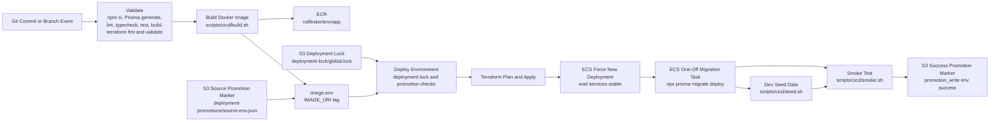
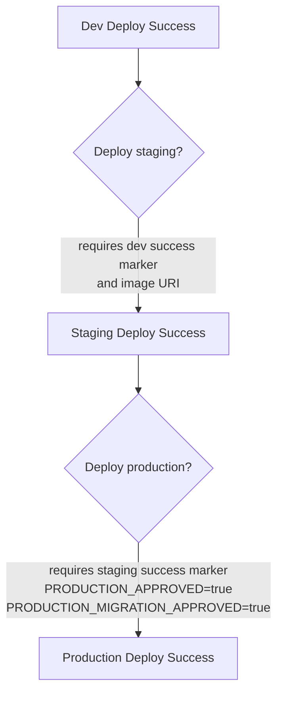
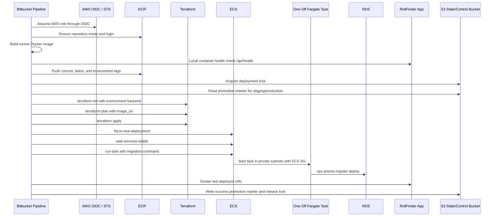

# Deployment Flow

This artifact shows how code moves from Bitbucket into AWS.

## CI/CD Overview

## Branch and Environment Rules

| Source | Pipeline Behavior | Environment |
| --- | --- | --- |
| Any branch/default pipeline | Static validation only | None |
| `feature/*` | Validate, build image, deploy | dev |
| `develop` | Validate, build image, deploy | dev |
| `staging` | Validate, manual promotion using dev promotion marker image | staging |
| `main` | Validate, manual promotion using staging promotion marker image with production flags | production |

## Promotion Controls

Controls implemented by the deployment scripts:

- `scripts/cicd/deploy-environment.sh` validates environment names.
- Staging requires a successful dev promotion marker.
- Production requires a successful staging promotion marker.
- Production deploys require `PRODUCTION_APPROVED=true`.
- Production migrations require `PRODUCTION_MIGRATION_APPROVED=true`.
- Deployments must hold the global deployment lock before `scripts/cicd/deploy.sh` runs.
- The deployment lock is an S3 object at `deployment-lock/global.lock` by default.
- Promotion markers are S3 objects under `deployment-promotions/<env>.json` by default.
- Direct non-dev deployments are blocked unless explicitly overridden.

## Runtime Deployment Steps

## Deployment Outputs

After Terraform apply and ECS stabilization, the deployment script prints:

- Environment name
- Frontend URL
- WWW URL, production only
- API URL
- ECS cluster name
- ECS service name
- Docker image URI
- ACM certificate ARN

## Environment Separation

Each environment uses:

- Shared Terraform artefact bucket named `rollfinder-<account-id>-terraform-artefact`
- Separate Terraform state keys under `dev/`, `staging/`, and `production/`
- Separate environment config under `terraform/environments/<env>/common.tfvars`
- Separate ECR repository path: `rollfinder/<env>/app`
- Separate Terraform-created resource names prefixed as `rollfinder-<env>`
- Separate database instance and Secrets Manager secret
- Shared deployment-control defaults in the dev Terraform state bucket unless `DEPLOYMENT_LOCK_BUCKET` or `PROMOTION_BUCKET` is overridden
